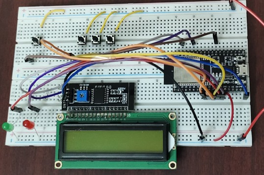
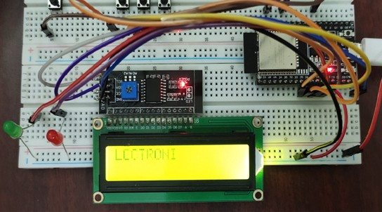
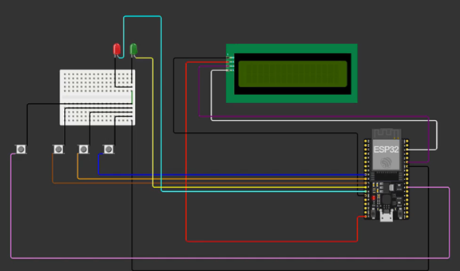
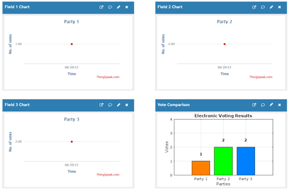
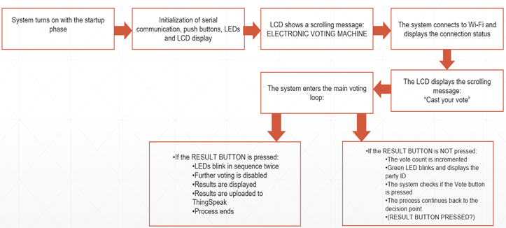

<div align="center">

# 🗳️ ESP32-Based Electronic Voting Machine with IoT Integration


**A secure, efficient, and cloud-connected voting system for modern elections**

[Overview](#-overview) • [Features](#-features) • [Hardware](#-hardware) • [System Architecture](#-system-architecture) • [Getting Started](#-getting-started)

---

</div>

## 🎯 Overview

This project presents a **fully functional Electronic Voting Machine (EVM)** built using the ESP32 microcontroller with integrated **IoT connectivity**. The system combines the simplicity of push-button voting with the power of real-time cloud monitoring through the **HTTP protocol** and **ThingSpeak platform**.

Designed for small-scale elections in institutions, communities, and organizations, this EVM enhances transparency, reduces manual errors, and provides instant result visualization—all while maintaining security and reliability.

### 💡 Why This Project?

Traditional paper-based voting systems are prone to errors, delays, and lack real-time monitoring. This IoT-enabled EVM addresses these challenges by:
- ✅ **Eliminating paper ballots** and manual counting
- ✅ **Providing instant feedback** through LED indicators and LCD display
- ✅ **Enabling remote monitoring** via cloud integration
- ✅ **Ensuring accuracy** through automated vote counting
- ✅ **Supporting scalability** for future enhancements

---

## ✨ Features

### Core Functionality

- 🔘 **Push-Button Voting**: Simple, intuitive interface for three parties
- 📊 **Real-Time Display**: 8x2 I2C LCD shows voting status and results
- 💡 **LED Feedback**: Instant visual confirmation of vote registration
- ☁️ **Cloud Integration**: HTTP-based data transmission to ThingSpeak
- 🔒 **Secure Operation**: Vote finalization prevents tampering
- 📱 **Remote Monitoring**: Live vote tracking from anywhere

### Technical Highlights

- **ESP32 Microcontroller**: Dual-core processor with built-in Wi-Fi
- **I2C Communication**: Efficient LCD interfacing
- **HTTP Protocol**: Standard web-based data transmission
- **Modular Code**: Clean, maintainable C++ firmware
- **Error Handling**: Robust connectivity and data validation

---

## 🔧 Hardware Components

### Bill of Materials

| Component | Specification | Quantity | Purpose |
|-----------|---------------|----------|---------|
| ESP32 Development Board | ESP-WROOM-32 | 1 | Main controller with Wi-Fi |
| LCD Display | 8x2 I2C (Address 0x27) | 1 | User interface and results |
| LEDs | Green & Red | 2 | Visual feedback |
| Push Buttons | Tactile switches | 4 | 3 vote buttons + 1 result button |
| Resistors | 10kΩ pull-up | 4 | Button debouncing |
| Jumper Wires | Male-to-Male/Female | As needed | Connections |
| Breadboard/PCB | Standard | 1 | Component mounting |
| Power Supply | 5V USB/Battery | 1 | System power |

### Component Specifications

**ESP32 Features:**
- Dual-core Xtensa 32-bit LX6 microprocessor
- Built-in Wi-Fi (802.11 b/g/n)
- 520 KB SRAM, 4 MB Flash
- 34 GPIO pins with I2C, SPI, UART support

**LCD Display:**
- 8 columns × 2 rows character display
- I2C interface (reduces pin usage)
- HD44780 compatible controller
- Adjustable backlight

---

## 🏗️ System Architecture

### Block Diagram

```
┌─────────────────────────────────────────────────────────────┐
│                      ESP32 CONTROLLER                        │
│                   (Wi-Fi + Processing)                       │
└────┬────────┬────────┬────────┬────────┬────────┬───────────┘
     │        │        │        │        │        │
     │        │        │        │        │        │
┌────▼───┐ ┌─▼──┐ ┌──▼───┐ ┌──▼───┐ ┌──▼───┐ ┌──▼────────┐
│ Vote   │ │Vote│ │Vote  │ │Result│ │Green │ │ 8x2 LCD   │
│Button 1│ │Btn2│ │Button│ │Button│ │ LED  │ │ (I2C)     │
│ (P1)   │ │(P2)│ │3(P3) │ │      │ │      │ │           │
└────────┘ └────┘ └──────┘ └──────┘ └──────┘ └───────────┘
                                        │
                                     ┌──▼───┐
                                     │ Red  │
                                     │ LED  │
                                     └──────┘
           │
           ▼
    ┌──────────────┐
    │   Wi-Fi      │
    │  Connection  │
    └──────┬───────┘
           │
           ▼
    ┌──────────────┐
    │ ThingSpeak   │
    │   Cloud      │
    │  (HTTP API)  │
    └──────────────┘
```

### System Workflow

```
START
  │
  ├─► Initialize Hardware (LCD, LEDs, Buttons)
  │
  ├─► Display Welcome Message
  │
  ├─► Connect to Wi-Fi Network
  │
  ├─► Enter Voting Mode
  │   │
  │   ├─► Display "Cast your vote"
  │   │
  │   ├─► Wait for button press
  │   │   │
  │   │   ├─► Vote Button Pressed?
  │   │   │   ├─► Increment vote count
  │   │   │   ├─► Blink green LED
  │   │   │   ├─► Show "Voted!" on LCD
  │   │   │   └─► Return to voting mode
  │   │   │
  │   │   └─► Result Button Pressed?
  │   │       ├─► LED Animation (Red + Green)
  │   │       ├─► Disable further voting
  │   │       ├─► Display "Voting Results"
  │   │       ├─► Show vote counts on LCD
  │   │       ├─► Upload to ThingSpeak
  │   │       └─► Display "THANK YOU"
  │   │
  │   └─► Loop until result button pressed
  │
END
```

### Pin Configuration

| Component | ESP32 GPIO | Function |
|-----------|------------|----------|
| Green LED | GPIO 14 | Vote confirmation indicator |
| Red LED | GPIO 12 | Result mode indicator |
| Result Button | GPIO 16 | Finalize and display results |
| Vote Button - Party 1 | GPIO 25 | Register vote for Party 1 |
| Vote Button - Party 2 | GPIO 26 | Register vote for Party 2 |
| Vote Button - Party 3 | GPIO 27 | Register vote for Party 3 |
| I2C SDA (LCD) | GPIO 21 | Serial data line |
| I2C SCL (LCD) | GPIO 22 | Serial clock line |

---

## 🖼️ Visual Gallery

### System Images

<div align="center">

| System OFF | System ON |
|:----------:|:---------:|
|  |  |

</div>

### Circuit Diagram



*Complete wiring diagram showing all connections*

### Results Display

<div align="center">

| LCD Results | ThingSpeak Cloud |
|:-----------:|:----------------:|
|  |  |

</div>

### Workflow Diagram



*System operation flow from startup to result display*

---

## 📁 Repository Structure

```
ESP32-Electronic-Voting-Machine/
│
├── 📄 README.md                          # Project documentation
├── 📄 LICENSE                            # MIT License
│
├── 📂 firmware/                          # Arduino/ESP32 Code
│   ├── evm_main.ino                      # Main firmware file
│   ├── config.h                          # Wi-Fi and API configuration
│   └── functions.cpp                     # Helper functions
│
├── 📂 hardware/                          # Hardware Design Files
│   ├── circuit_diagram.png               # Wiring diagram
│   ├── schematic.pdf                     # Detailed schematic
│   ├── pcb_layout.pdf                    # PCB design (if available)
│   └── BOM.csv                           # Bill of materials
│
├── 📂 images/                            # Documentation Images
│   ├── system_off.jpg                    # Hardware image (OFF)
│   ├── system_on.jpg                     # Hardware image (ON)
│   ├── lcd_results.jpg                   # LCD showing results
│   ├── thingspeak_results.png            # Cloud visualization
│   ├── circuit_diagram.png               # Circuit connections
│   └── block_diagram.png                 # System architecture
│
├── 📂 docs/                              # Additional Documentation
│   ├── project_report.pdf                # Complete project report
│   ├── user_manual.md                    # Operating instructions
│   └── api_documentation.md              # ThingSpeak API usage
│
└── 📂 examples/                          # Code Examples
    ├── test_lcd.ino                      # LCD test code
    ├── test_wifi.ino                     # Wi-Fi connectivity test
    └── test_buttons.ino                  # Button input test
```

---

## 🚀 Getting Started

### Prerequisites

**Hardware Requirements:**
- ESP32 development board
- 8x2 I2C LCD display
- Push buttons (×4)
- LEDs (Green & Red)
- Connecting wires
- Breadboard or PCB

**Software Requirements:**
```
- Arduino IDE (v1.8.13 or later)
- ESP32 Board Support Package
- Required Libraries:
  ├── WiFi.h (built-in)
  ├── Wire.h (built-in)
  └── LiquidCrystal_I2C.h
```

### Installation Steps

#### 1. **Install Arduino IDE**
```bash
# Download from: https://www.arduino.cc/en/software
# Install for your operating system
```

#### 2. **Add ESP32 Board Support**
- Open Arduino IDE
- Go to `File > Preferences`
- Add to "Additional Board Manager URLs":
  ```
  https://dl.espressif.com/dl/package_esp32_index.json
  ```
- Go to `Tools > Board > Boards Manager`
- Search for "ESP32" and install

#### 3. **Install Required Libraries**
```bash
# In Arduino IDE:
# Sketch > Include Library > Manage Libraries
# Search and install: LiquidCrystal_I2C
```

#### 4. **Clone the Repository**
```bash
git clone https://github.com/yourusername/ESP32-Electronic-Voting-Machine.git
cd ESP32-Electronic-Voting-Machine
```

#### 5. **Configure Wi-Fi and API**
Edit `firmware/config.h`:
```cpp
const char* ssid = "YOUR_WIFI_SSID";
const char* password = "YOUR_WIFI_PASSWORD";
const char* apiKey = "YOUR_THINGSPEAK_API_KEY";
```

#### 6. **Upload Firmware**
- Connect ESP32 via USB
- Select board: `Tools > Board > ESP32 Dev Module`
- Select port: `Tools > Port > COM/dev/ttyUSB`
- Click **Upload** ✅

#### 7. **Hardware Assembly**
Follow the circuit diagram in `hardware/circuit_diagram.png`

---

## 🔬 How It Works

### Voting Process

1. **Startup Sequence**
   - System displays "ELECTRONIC VOTING MACHINE"
   - Connects to configured Wi-Fi network
   - Shows "Cast your vote" scrolling message

2. **Casting a Vote**
   - Voter presses one of three vote buttons (P1, P2, or P3)
   - Green LED blinks to confirm registration
   - LCD displays "Voted!" with party name
   - Vote counter increments internally
   - System returns to voting prompt

3. **Viewing Results**
   - Press the Result Button
   - Red and Green LEDs blink in sequence
   - LCD displays vote counts for all parties
   - Data is uploaded to ThingSpeak cloud
   - "THANK YOU" message displayed

### Cloud Integration

**ThingSpeak Setup:**
1. Create account at https://thingspeak.com
2. Create a new channel with 3 fields:
   - Field 1: Party 1 Votes
   - Field 2: Party 2 Votes
   - Field 3: Party 3 Votes
3. Copy the Write API Key
4. Configure in firmware

**Data Format:**
```http
POST /update HTTP/1.1
Host: api.thingspeak.com
Content-Type: application/x-www-form-urlencoded

api_key=YOUR_API_KEY&field1=5&field2=3&field3=7
```

---

## 📊 Features in Detail

### 1. Scrolling Text Display
Custom function handles smooth text scrolling on the compact 8x2 LCD:
```cpp
void startScroll(String text, int row, bool loopForever);
void handleScroll(unsigned long currentMillis);
```

### 2. Vote Registration
Debounced button handling with visual feedback:
```cpp
void registerVote(String party) {
    blinkGreenLED();
    lcd.print("Voted!");
    lcd.print(party);
}
```

### 3. Result Display
Sequential display of all vote counts:
```cpp
void showResults() {
    // Display P1 votes
    // Display P2 and P3 votes
    // Upload to cloud
}
```

### 4. HTTP Data Transmission
Reliable cloud upload with error handling:
```cpp
void sendToThingSpeak() {
    if (WiFi.status() == WL_CONNECTED) {
        // POST request to ThingSpeak API
    }
}
```

---

## 🎓 Use Cases

### Institutional Voting
- ✅ College/University student elections
- ✅ Faculty committee selections
- ✅ Department representative voting

### Corporate Applications
- ✅ Board meeting decisions
- ✅ Shareholder voting
- ✅ Employee polls and surveys

### Community Elections
- ✅ Housing society committees
- ✅ Local club elections
- ✅ NGO governance voting

### Other Applications
- ✅ Classroom polls and quizzes
- ✅ Event feedback collection
- ✅ Opinion surveys with instant results

---

## 🔮 Future Enhancements

### 🔐 Security Features
- **Biometric Authentication**: Fingerprint sensor integration (R307, GT-521F)
- **Encrypted Communication**: HTTPS/TLS for data transmission
- **Blockchain Logging**: Immutable audit trail using blockchain
- **Secure Boot**: ESP32 secure boot for firmware integrity

### 📈 Scalability
- **Multi-Booth Support**: MQTT-based aggregation from multiple devices
- **Database Backend**: Replace ThingSpeak with Firebase/AWS IoT
- **OTA Updates**: Over-the-air firmware updates
- **Device Management**: Centralized configuration and monitoring

### 🎨 User Interface
- **Touchscreen Display**: TFT LCD for better UX
- **Multi-Language Support**: Localization for different regions
- **Mobile App**: Companion app for result monitoring
- **Web Dashboard**: Admin panel for election management

### ⚡ Advanced Features
- **Battery Backup**: UPS integration for power resilience
- **Audio Feedback**: Voice prompts for accessibility
- **Receipt Printing**: Vote confirmation receipts
- **Advanced Analytics**: Real-time trend analysis and predictions

### ♿ Accessibility
- **Voice Guidance**: Audio instructions for visually impaired
- **Tactile Buttons**: Braille labels and larger buttons
- **Contrast Modes**: High-contrast display options
- **Adjustable Fonts**: Configurable text size

---

## 🛠️ Troubleshooting

### Common Issues

**1. LCD Not Displaying**
```
Problem: Blank LCD screen
Solution:
- Check I2C address (default 0x27, try 0x3F)
- Verify SDA/SCL connections
- Adjust LCD contrast potentiometer
- Test with I2C scanner code
```

**2. Wi-Fi Connection Failed**
```
Problem: Cannot connect to network
Solution:
- Verify SSID and password
- Check 2.4GHz network (ESP32 doesn't support 5GHz)
- Move closer to router
- Check router security settings (WPA2 recommended)
```

**3. Buttons Not Responding**
```
Problem: Vote buttons not registering
Solution:
- Check pull-up resistor connections
- Verify GPIO pin assignments
- Test button continuity with multimeter
- Add debouncing delays in code
```

**4. ThingSpeak Upload Failure**
```
Problem: Data not appearing on cloud
Solution:
- Verify API key is correct
- Check ThingSpeak channel settings
- Ensure field numbers match (field1, field2, field3)
- Check rate limit (ThingSpeak free tier: 15 sec interval)
```

---

## 📚 Code Documentation

### Main Functions

| Function | Purpose | Parameters |
|----------|---------|------------|
| `setup()` | Initialize hardware and Wi-Fi | None |
| `loop()` | Main program loop | None |
| `connectToWiFi()` | Establish Wi-Fi connection | None |
| `startScroll()` | Initialize text scrolling | text, row, loop |
| `handleScroll()` | Update scrolling animation | currentMillis |
| `registerVote()` | Process vote and update display | party |
| `blinkGreenLED()` | Visual vote confirmation | None |
| `resultButtonAnimation()` | LED sequence for results | None |
| `showResults()` | Display final vote counts | None |
| `sendToThingSpeak()` | Upload data to cloud | None |

### Configuration Parameters

```cpp
// Wi-Fi Settings
const char* ssid = "YOUR_WIFI_SSID";
const char* password = "YOUR_PASSWORD";

// ThingSpeak API
const char* server = "api.thingspeak.com";
const char* apiKey = "YOUR_API_KEY";

// GPIO Pin Assignments
const int greenLED = 14;
const int redLED = 12;
const int resultButton = 16;
const int voteButton1 = 25;
const int voteButton2 = 26;
const int voteButton3 = 27;

// I2C LCD Configuration
LiquidCrystal_I2C lcd(0x27, 8, 2);
```

---

## 🤝 Contributing

Contributions are welcome! Here's how you can help improve this project:

### Ways to Contribute

1. **🐛 Report Bugs**: Open an issue with detailed description
2. **💡 Suggest Features**: Share your ideas for enhancements
3. **📝 Improve Documentation**: Fix typos, add examples
4. **🔧 Submit Code**: Fork, modify, and create pull requests
5. **⭐ Star the Repo**: Show your support!

### Contribution Guidelines

1. Fork the repository
2. Create a feature branch (`git checkout -b feature/AmazingFeature`)
3. Commit your changes (`git commit -m 'Add some AmazingFeature'`)
4. Push to the branch (`git push origin feature/AmazingFeature`)
5. Open a Pull Request

### Code Standards

- Follow Arduino IDE formatting conventions
- Comment complex logic sections
- Test thoroughly before submitting
- Update documentation for new features

---

## 📝 License

This project is licensed under the **MIT License** - see the [LICENSE](LICENSE) file for details.

### MIT License Summary
✅ Commercial use  
✅ Modification  
✅ Distribution  
✅ Private use  
⚠️ Liability and warranty disclaimer

---

## 📖 References

1. **Espressif Systems** - ESP32 Technical Reference Manual  
   https://docs.espressif.com/projects/esp-idf/en/latest/esp32/

2. **Hitachi** - HD44780U LCD Controller/Driver Datasheet

3. **MathWorks** - ThingSpeak Documentation  
   https://www.mathworks.com/help/thingspeak/

4. **Arduino-ESP32** - GitHub Repository  
   https://github.com/espressif/arduino-esp32

5. **LiquidCrystal_I2C** - Arduino Library  
   https://github.com/johnrickman/LiquidCrystal_I2C

---

<div align="center">

## 👨‍🎓 About the Author

**Pranjal Upadhyay**  
Roll No: 523EC0012

**Department of Electronics and Communication Engineering**  
Integrated B.Tech and M.Tech Program

**Indian Institute of Information Technology Design and Manufacturing, Kurnool**

---

</div>

---

<div align="center">

### ⭐ Star this repository if you found it helpful!

**Made with ❤️ for IoT and Embedded Systems enthusiasts**

[](https://github.com/yourusername/ESP32-Electronic-Voting-Machine/stargazers)
[](https://github.com/yourusername/ESP32-Electronic-Voting-Machine/network/members)

---

© 2025 Pranjal Upadhyay. All Rights Reserved.

</div>
